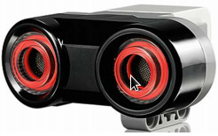
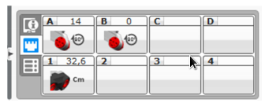
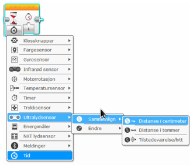

# Oppgave 3.1 – Ultralydsensor {.intro}

I disse oppgavene skal vi ta i bruk ultralydsensoren, og lære å bruke
ultralydsensoren til å måle avstander til objekter. Deretter kan vi få roboten
til å utføre ulike oppgaver basert på informasjon som den får fra sensoren.

Ultralydsensoren sender ut lydbølger og tolker ekkoene den får tilbake til å
finne gjenstander og måle avstanden til den. I denne oppgaven skal vi konstruere
og programmere roboten slik at den gjennom å bruke ultralydsensor stopper en
gitt avstand fra et objekt.

## Fremgangsmåte {.check}

- [ ] Konstruere et feste til Ultralydsensoren slik at den ikke står veien for
      andre deler på roboten. Du finner alternativ plassering i
      instruksjonsboken.

- [ ] Koble til Ultralydsensoren til EV3 roboten ved hjelp av en kabel. Kabelen
      skal kobles til en av portene merket med 1-4.

- [ ] Nede til høyre i LEGO Mindstorms programmet kan du nå se om den er koblet
      til korrekt, og du kan også lese av avstanden til objektene.

- [ ] Hold hånden eller et objekt foran ultralydsensoren. Les av avstanden.
      Flytt objektet nærmere og lengre fra ultralydsensoren. Hva skjer?

- [ ] Foran veggen er det laget en linje med teip. Roboten skal stoppe så tett
      opp til linjen som mulig, men ikke krysse den.

- [ ] Ultralydsensoren finner du under «Flytkontroll». Velg «Sammenlign» og
      «Distanse i centimeter».

- [ ] Sett sammenligning til «Mindre enn».

Et ferdig program, kan se slik ut: 

